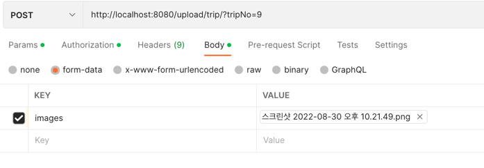

# To-Do List
## 9.15
### in progress
jpa place setting

### done
~~spring boot setting~~

jpa findBy~ 할때
pk같은 경우는
findBy{PK} = 대신에 첫글자는 전부 대문자 나머지는 동일
fk 같은 경우는
findBy{table 이름}_{fk}= 이것도 전부 첫글자는 대문자
List<Trip> findAllByUser_id(Long userNo);

## 9.27
user로 로그인 해야 접속이 가능하게 구현
일정에 하나업로드 테스트 하려면 이렇게 진행하여야 합니다아아
http://localhost:8080/upload/trip/?tripNo=9
form-data : images 하고 이미지 업로드

- 문제는 swagger에서 테스트 할때 어떻게 해야하는지는 알아올 필요가 있음.

